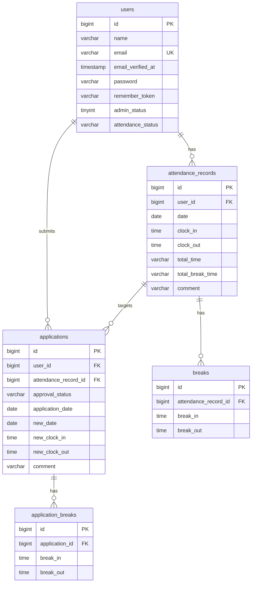

# coachtech-mockcase-2

## 環境構築

Docker ビルド  
1.git clone git@github.com:Estra-Coachtech/coachtech-mockcase-2.git  
2.docker-compose up -d --build

Lavaral 環境構築  
1.docker-compose exec php bash  
2.composer install  
3.cp .env.example .env  
4..env ファイルの変更

```
　DB_HOSTをmysqlに変更
　DB_DATABASEをlaravel_dbに変更
　DB_USERNAMEをlaravel_userに変更
　DB_PASSをlaravel_passに変更
　MAIL_FROM_ADDRESSに送信元アドレスを設定
```

5.php artisan key:generate  
6.php artisan migrate  
7.php artisan db:seed  
8.php artisan test

## テーブル仕様

### users テーブル

| カラム名          | 型           | primary key | unique key | not null | foreign key |
| ----------------- | ------------ | ----------- | ---------- | -------- | ----------- |
| id                | bigint       | ◯           |            | ◯        |             |
| name              | varchar(255) |             |            | ◯        |             |
| email             | varchar(255) |             | ◯          | ◯        |             |
| email_verified_at | timestamp    |             |            |          |             |
| password          | varchar(255) |             |            | ◯        |             |
| remember_token    | varchar(100) |             |            |          |             |
| created_at        | timestamp    |             |            |          |             |
| updated_at        | timestamp    |             |            |          |             |
| admin_status      | tinyint      |             |            | ◯        |             |
| attendance_status | varchar(255) |             |            | ◯        |             |

### attendance_records テーブル

| カラム名         | 型           | primary key | unique key | not null | foreign key |
| ---------------- | ------------ | ----------- | ---------- | -------- | ----------- |
| id               | bigint       | ◯           |            | ◯        |             |
| user_id          | bigint       |             |            | ◯        | users(id)   |
| date             | date         |             |            | ◯        |             |
| clock_in         | time         |             |            | ◯        |             |
| clock_out        | time         |             |            |          |             |
| total_time       | varchar(255) |             |            |          |             |
| total_break_time | varchar(255) |             |            |          |             |
| comment          | varchar(255) |             |            |          |             |
| created_at       | timestamp    |             |            |          |             |
| updated_at       | timestamp    |             |            |          |             |

### breaks テーブル

| カラム名             | 型        | primary key | unique key | not null | foreign key            |
| -------------------- | --------- | ----------- | ---------- | -------- | ---------------------- |
| id                   | bigint    | ◯           |            | ◯        |                        |
| attendance_record_id | bigint    |             |            | ◯        | attendance_records(id) |
| break_in             | time      |             |            | ◯        |                        |
| break_out            | time      |             |            |          |                        |
| created_at           | timestamp |             |            |          |                        |
| updated_at           | timestamp |             |            |          |                        |

### applications テーブル

| カラム名             | 型           | primary key | unique key | not null | foreign key            |
| -------------------- | ------------ | ----------- | ---------- | -------- | ---------------------- |
| id                   | bigint       | ◯           |            | ◯        |                        |
| user_id              | bigint       |             |            | ◯        | users(id)              |
| attendance_record_id | bigint       |             |            | ◯        | attendance_records(id) |
| approval_status      | varchar(255) |             |            | ◯        |                        |
| application_date     | date         |             |            | ◯        |                        |
| new_date             | date         |             |            | ◯        |                        |
| new_clock_in         | time         |             |            | ◯        |                        |
| new_clock_out        | time         |             |            | ◯        |                        |
| comment              | varchar(255) |             |            | ◯        |                        |
| created_at           | timestamp    |             |            |          |                        |
| updated_at           | timestamp    |             |            |          |                        |

### application_breaks テーブル

| カラム名       | 型        | primary key | unique key | not null | foreign key      |
| -------------- | --------- | ----------- | ---------- | -------- | ---------------- |
| id             | bigint    | ◯           |            | ◯        |                  |
| application_id | bigint    |             |            | ◯        | applications(id) |
| break_in       | time      |             |            | ◯        |                  |
| break_out      | time      |             |            |          |                  |
| created_at     | timestamp |             |            |          |                  |
| updated_at     | timestamp |             |            |          |                  |

## ER 図



## API エンドポイント一覧（応用）

公開 API v1。読み取り系（GET）は認証不要、書き込み系（POST / PUT / DELETE）は Sanctum 認証必須で、PUT / DELETE は本人または管理者のみ操作可能。

| HTTPメソッド | URI | 説明 | 認証・認可 |
| ------------ | --------------------------------------------- | ------------------ | ----------------------------------------- |
| GET | /api/v1/attendance-records | 勤怠一覧を取得する | 不要 |
| GET | /api/v1/attendance-records/{attendanceRecord} | 勤怠詳細を取得する | 不要 |
| POST | /api/v1/attendance-records | 勤怠を新規登録する | Sanctum 必須 |
| PUT / PATCH | /api/v1/attendance-records/{attendanceRecord} | 勤怠を更新する | Sanctum + Policy（本人または管理者のみ） |
| DELETE | /api/v1/attendance-records/{attendanceRecord} | 勤怠を削除する | Sanctum + Policy（本人または管理者のみ） |

## ログイン情報

一般ユーザー  
　 id：user1@example.com／user2@example.com  
　 pass：password  
管理者  
　 id：user3@example.com  
　 pass：password

## 使用技術

・PHP 7.4.9  
・Laravel 8.83.8  
・MySQL 8.0.26  
・nginx 1.21.1  
・MailHog latest

## URL

・開発環境：http://localhost/  
・phpMyAdmin：http://localhost:8080/  
・MailHog：http://localhost:8025/
