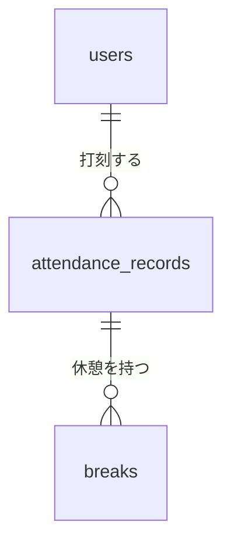
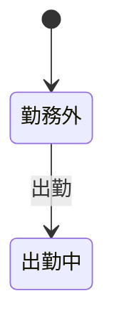
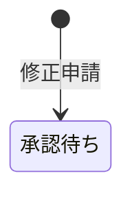
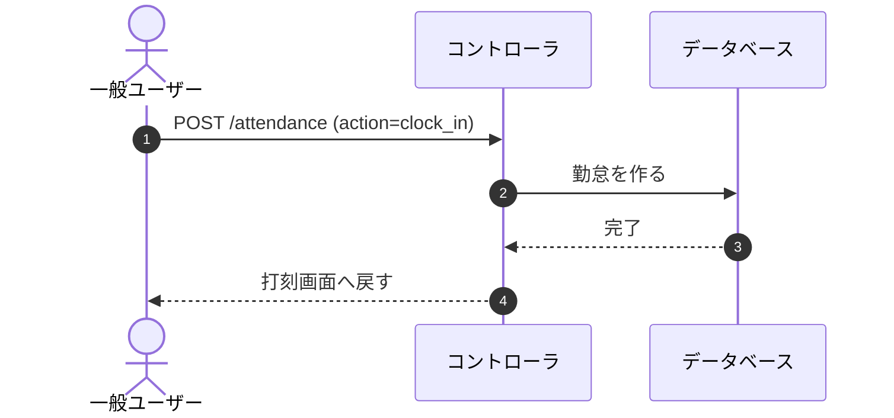

# 模擬案件\_勤怠管理アプリ\_提出物ガイド（設計書一式）

> 本ドキュメントは、模擬案件「勤怠管理アプリ」で提出する**設計書一式**の書式と規約です。
> 要件の中身は「要件シート」に、採点基準は「評価シート」にあります。本書は**入れ物の決まり**だけを扱います。
> ファイル名と図の記法は Tutorial 16「総仕上げ」で作った設計書一式と揃えてあります。
> 置き場だけは `docs/` 直下です（Tutorial 16 は仕様書を同じリポジトリで受け取るため `docs/design/` に分けていましたが、
> この課題は要件シートがリポジトリの外にあるので、分ける必要がありません）。

---

## 1. 設計書は何のために出すのか

この課題は、**要件を受け取る → 曖昧なところをPMに確認する → 設計する → 実装する**、という実務の流れをそのまま回すものです。設計書は、この流れのうち「設計した」という工程の成果物にあたります。

実装に入る前に、次の3つを自分の言葉で確定させてください。

1. 何を作って、何を作らないか
2. 要件のどこが曖昧で、それをどう決めたか
3. 決めた内容を、画面・データ・権限・振る舞い・受け入れ条件の形にどう落とすか

**設計書は、これを見た人（自分の1か月後・チームの他の人・AI）が、質問せずに実装へ進める状態になっていれば合格です。**

---

## 2. 置き場とファイル

提出リポジトリの **`docs/`** 配下に、次の**7ファイル**を置いてください。

| ファイル | 中身 | Tutorial 13 の対応 |
|---|---|---|
| `features.md` | 機能一覧／今回作らないもの | 13-2 |
| `questions.md` | 確認事項リスト（自分で洗い出す） | 13-2 |
| `screens.md` | 画面一覧／画面遷移図／画面項目定義／入力チェックとエラーメッセージ | 13-3 |
| `data.md` | ER図／テーブル定義書／CRUD表 | 13-5 |
| `permissions-api.md` | 権限マトリクス／ルーティング一覧／公開APIの設計 | 13-4 |
| `behavior.md` | 状態遷移図／シーケンス図／例外とエラーの方針 | 13-6 |
| `acceptance.md` | 試す前の準備／受け入れ条件／テスト観点 | 13-8 |

> 💡 **Tutorial 16 の7ファイルをそのまま使います。** この課題は、打刻ステータス（勤務外 → 出勤中 ⇄ 休憩中 → 退勤済）と
> 修正申請の承認（承認待ち → 承認済み）という**2つの状態遷移が中核**なので、`behavior.md` を外しません。

> ⚠️ **`docs/` の中に画像ファイルを置かないでください。** 図は Mermaid のテキストで Markdown の中に書きます（→ §3-4）。README に貼る ER図の画像は `docs/` の外に置いてください。

---

## 3. 全ファイル共通の規約

### 3-1. 見出しは固定

各ファイルの `##` 見出しは、§4 に書いた**名前・順番のとおり**にしてください。見出しの配下を空にしないこと。書くことが無い場合も、空欄にせず「なし」とその理由を1行書きます（**「検討した結果ゼロ」と「書き忘れ」を区別するため**）。

### 3-2. IDの書式

| 成果物 | ID | 例 |
|---|---|---|
| 機能一覧 | `F-` ＋ゼロ埋め2桁 | `F-01` |
| 確認事項 | `Q-` ＋ゼロ埋め2桁 | `Q-01` |
| 画面一覧 | `SC-` ＋ゼロ埋め2桁 | `SC-01` |
| 公開API | `API-` ＋ゼロ埋め2桁 | `API-01` |
| 受け入れ条件 | `AC-` ＋ゼロ埋め2桁 | `AC-01` |
| テスト観点 | `TC-` ＋ゼロ埋め2桁 | `TC-01` |

IDは他の表から参照するためのアンカーです。重複させないでください。

### 3-3. 表の列

**列名と列数を厳密に合わせる必要があるのは `questions.md` の確認事項の表だけ**です（採点で機械的に読むため）。
それ以外の表の列は**目安**なので、Tutorial 13・16 で自分が使った形のままで構いません。列を足しても減らしても採点には影響しません。

### 3-4. 図は Mermaid のテキストで書く

図は Markdown の中に ` ```mermaid ` のコードブロックで書きます。**画像ファイル（`.png` / `.jpg` / `.svg` / `.drawio`）は置きません。**

| 場所 | 図の型 | 採点 |
|---|---|---|
| `data.md` 1章 | `erDiagram` | **見ます**（パースできること） |
| `screens.md` 2章 | `flowchart`（向きは自由） | **見ます**（パースできること） |
| `behavior.md` 1章 | `stateDiagram-v2` | 見出しの配下が空でないことだけ見ます |
| `behavior.md` 2章 | `sequenceDiagram` | 同上 |

Tutorial 13 では draw.io で手描きしましたが、この課題では Mermaid です。記法は 8-1-5（ER図の読み方）と Tutorial 14・16 で扱ったものと同じです。最小の雛形は §7 のテンプレートに入っています。

### 3-5. 識別子はバッククォートで囲む

テーブル名・カラム名・パス・状態の値は `` ` `` で囲んでください（例: `` `users` ``、`` `clock_in` ``、`` `/attendance/{id}` ``、`` `勤務外` ``）。

### 3-6. 要件シートの言葉をそのまま使う

要件シートに出てくる語（画面名・機能名・データ名・入力項目名）は、**言い換えずにそのまま使ってください**。言い換えると、要件と設計書のどれが同じものを指しているのかが追えなくなります。

### 3-7. 実装中に決めが変わったら、設計書を先に直す

実装しているうちに設計を変えたくなることがあります。そのときは**コードではなく設計書を先に直して**から、実装に戻ってください。提出時点で設計書と実装が食い違っていないことが、この課題での「完成」です。

---

## 4. ファイルごとの構成

### 4-1. `features.md`

```
## 1. 機能一覧
## 2. 今回作らないもの
```

**1. 機能一覧** — 列は `ID` ｜ `機能` ｜ `主な利用者` ｜ `概要`
**2. 今回作らないもの** — 列は `作らないもの` ｜ `理由`

> 書くのは「作らないと**決まった**もの」だけです。まだ決まっていないものは `questions.md` に書き、確認が取れたらこの表に移します。理由の列を空けないでください。

### 4-2. `questions.md`

```
## 1. 確認事項
## 2. 自分で決めたことの根拠
```

**1. 確認事項** — 列は `ID` ｜ `確認したいこと` ｜ `自分の想定` ｜ `状態` ｜ `決めたこと`

この表が、この課題でいちばん大事な成果物です。要件シートは**詳細度50%**で、書かれていないことが数多くあります。それを自分で洗い出して、PM（コーチ）に確認するか、確認が取れなければ自分で決めます。

- **`確認したいこと`** は問いの形で書きます
- **`自分の想定`** を先に書いてから聞いてください。「〜はどうしますか？」と受け身で聞くより、**「〜という設計にしましたが、問題ないですか？」と仮説を提案する形**のほうが、PMも答えやすく、やり取りが早く終わります
- **`状態`** は次の5語のいずれかで書きます（Tutorial 13・16 で使ったものと同じです）

  | 語 | 意味 | 提出時に残ってよいか |
  |---|---|---|
  | `未確認` | まだ確認していない | ✗ |
  | `一部回答` | 聞いたことの一部にしか答えが返っていない | ✗ |
  | `回答なし` | 確認したが、PMが答えられない領域だった | ✗ |
  | `回答済み` | PMから回答を得た | ○ |
  | `自分で決めた` | 回答が得られなかった／確認せずに、自分で判断した | ○ |

- **提出時点で残してよいのは `回答済み` と `自分で決めた` の2つだけ**です。`未確認`・`一部回答`・`回答なし` のまま実装に進むことはできません（実装している以上、何かは決まっているはずです）。答えが返らなかった行は、自分で決めて `自分で決めた` に変えてください
- **`決めたこと`** は全行埋めてください

> ⚠️ **PMが答えない領域があります。** テーブル名・カラム名・型・制約、バリデーションの記法（`required` などのルールの書き方）、クラス構成やアルゴリズムは、エンジニアが自分で判断する領分です。聞いても答えは返りません。その場合は `回答なし` として、自分で決めた内容を書いてください。

**2. 自分で決めたことの根拠** — 表でなくて構いません。`状態` が `自分で決めた` の行について、**なぜそう決めたのか**を残します。あとで食い違いが出たときに、どこで決めたのかをたどれるようにするためです。

### 4-3. `screens.md`

```
## 1. 画面一覧
## 2. 画面遷移図
## 3. 画面項目定義
## 4. 入力チェックとエラーメッセージ
```

**1. 画面一覧** — 列は `ID` ｜ `画面名` ｜ `メソッド` ｜ `パス` ｜ `認証` ｜ `認可`
**2. 画面遷移図** — ` ```mermaid ` の `flowchart`
**3. 画面項目定義** — 列は `画面ID` ｜ `項目` ｜ `内容` ｜ `表示条件`
**4. 入力チェックとエラーメッセージ** — 列は `画面ID` ｜ `項目` ｜ `必須` ｜ `制約` ｜ `エラーメッセージ`

> 💡 **全画面ぶんの画面項目定義は要りません。** どこまで書くかを決めるのも設計です。省いた画面と、省いた理由を1行残してください。
> 必須の列は `○` ／ `−` で書きます。

> 💡 **打刻画面は「表示条件」が主役です。** 同じURLでも、打刻ステータスによって出るボタンが変わります。項目の一覧より、どの状態で何が出るかのほうが実装に効きます。

### 4-4. `data.md`

```
## 1. ER図
## 2. テーブル定義書
## 3. CRUD表
```

**1. ER図** — ` ```mermaid ` の `erDiagram`。多重度は記号で表します（`||--o{` など）。線に添える文章だけで多重度を表さないでください
**2. テーブル定義書** — 列は `テーブル` ｜ `カラム` ｜ `型` ｜ `PK` ｜ `NOT NULL` ｜ `FK` ｜ `補足`
**3. CRUD表** — 1列目が `機能ID`、2列目以降に自分が設計したテーブル名を並べます

> 💡 CRUD表で埋まらない行が出たら、**行を消さずに残して理由を書いてください**。テーブルに触れないことと、機能が無いことは違います。

> 💡 **計算して出す値をカラムにするかどうかは設計です。** 労働時間や休憩合計のように、打刻から計算できる値を
> テーブルに持つのか、取り出すときに計算するのかは、あなたが決めて理由を残してください。

### 4-5. `permissions-api.md`

```
## 1. 権限マトリクス
## 2. ルーティング一覧
## 3. 公開APIの設計
```

**1. 権限マトリクス** — 列は `機能ID` ｜ `未ログイン` ｜ `一般ユーザー（本人）` ｜ `一般ユーザー（他人）` ｜ `管理者` ｜ `条件`
**2. ルーティング一覧** — 列は `メソッド` ｜ `パス` ｜ `ルート名` ｜ `認証` ｜ `認可`
**3. 公開APIの設計** — 列は `ID` ｜ `メソッド` ｜ `パス` ｜ `概要` ｜ `認証`。表の下に、代表的なリクエスト／レスポンスを ` ```json ` で書きます

> 💡 **列の切り方は決まっていません。** 上の5列は目安です。この課題は「本人／他人／管理者」で判定が分かれるので分けてありますが、
> あなたのアプリで判定が分かれるところに合わせて構いません（Tutorial 16 でも列は4つでした）。

> 💡 **権限マトリクスの形に入らないものがあります。** この表が答えるのは「対象1つに対して、その操作をしてよいか」です。一覧の絞り込みや公開APIの読み取りは対象が1つに決まらないので、表ではなく `条件` 列か本文で書いてください。

### 4-6. `behavior.md`

```
## 1. 状態遷移図
## 2. シーケンス図
## 3. 例外とエラーの方針
```

**1. 状態遷移図** — ` ```mermaid ` の `stateDiagram-v2`。この課題には状態を持つものが2つあります（打刻ステータスと、修正申請の承認状態）。**両方書いてください**
**2. シーケンス図** — ` ```mermaid ` の `sequenceDiagram`。**代表を1本だけ**で構いません。複数の登場人物とデータが動くもの（修正申請 → 管理者の承認 → 勤怠情報への反映、など）を選ぶと、決めたことが一度に通ります
**3. 例外とエラーの方針** — 表でなくて構いません。次のような「どちらでも作れてしまう」ところを、どちらにしたか書きます

- 他人の勤怠詳細を開こうとしたとき、404 で隠すのか 403 で断るのか
- 出勤していない日に休憩を押したときのように、画面上は起きないはずの操作が来たときにどうするのか
- 二重送信や、同じ日の勤怠が2つできそうなときにどこで弾くのか

> 💡 **状態遷移図の読み方**（Tutorial 16 で扱ったものと同じです）: `[*]` が始まりと終わりを表します。
> `[*]` から出る矢印が「まだ無い」から生まれるところ、`[*]` へ向かう矢印が行そのものが消えるところです。

### 4-7. `acceptance.md`

```
## 1. 試す前の準備
## 2. 受け入れ条件
## 3. テスト観点
```

**1. 試す前の準備** — **`db:seed` を実行したとき、全機能の動作確認ができる状態になっているか**。要件シート「初期データ」の各条件を、どのデータで満たしたのかを書きます（表でなくて構いません）。実務でも、機能の検証を可能にするデータの設計はエンジニアの仕事です
**2. 受け入れ条件** — 列は `ID` ｜ `機能ID` ｜ `条件`。「〜すると、〜になる」という**観察できる結果**の形で、1機能につき2〜4行
**3. テスト観点** — 列は `ID` ｜ `何を確かめるか` ｜ `区分`。観点だけを書き、手順は書きません

---

## 5. 書く量の目安

上限を決めておきます。多く書いた設計書が良い設計書ではありません。あとから読む人が判断に使う分だけを書きます。

| 対象 | 目安 |
|---|---|
| 画面一覧 | 要件シートの画面定義と同数 |
| 画面項目定義 | 全画面ぶんは書かない。省いた理由を残す |
| 入力チェック | 要件シートの入力要件に挙がった項目と同数 |
| 状態遷移図 | 2つ（打刻ステータス・修正申請の承認状態） |
| シーケンス図 | 代表1本 |
| 例外とエラーの方針 | 判断が分かれるところだけ |
| 試す前の準備 | 要件シート「初期データ」の条件と対応が取れる分だけ |
| 受け入れ条件 | 1機能につき2〜4行 |
| テスト観点 | 観点だけ。手順は書かない |
| 確認事項 | 上限なし |
| クラス図 | 作らない |

所要時間の目安は置きません。確認事項の確認は**任意**なので、回答を待たずに自分で決めて先へ進んで構いません（決めた内容と理由を残してください）。

---

## 6. 採点されること／されないこと

**設計の巧拙は評価に含みません。** 設計の内容は、実装が要件どおり動くかという形で評価されます。設計が誤っていれば、実装の振る舞いが要件と食い違って落ちます。

設計書そのものについて確認するのは、次の3つだけです（合計6点）。

| 見るもの | 内容 |
|---|---|
| ファイルと見出し | `docs/` に7ファイルがあり、§4 の `##` 見出しが順番どおり揃い、配下が空でない（**表の列は見ません**） |
| 図の記法 | `data.md` 1章に `erDiagram`、`screens.md` 2章に `flowchart` の Mermaid があり、パースできる。`docs/` に画像ファイルが無い |
| 確認事項リスト | `Q-` 形式のIDが振られ、`状態` が §4-2 の5語のいずれかで、`未確認`・`一部回答`・`回答なし` が残っておらず、`決めたこと` が全行埋まっている |

いずれも決定的な判定です。設計の良し悪し・粒度・判断の妥当性は見ません。

> 💡 **`behavior.md` の図は採点しません。** 見出しがあって配下が空でなければ通ります。状態遷移図とシーケンス図は
> 実装のために書くもので、書式で測る対象ではないためです。

> ⚠️ **`questions.md` に「承認を得た」と書いてあるだけでは、要件と違う実装が通る根拠にはなりません。**
> 承認の効力がもっとも強いのは、LMS のテスト質問に残ったコーチの回答です（コーチ自身の記述なので確定できます）。
> 面談で確認した場合は LMS に記録が残らないので、**いつ・誰に・何を確認したのかが分かる形**で書いてください。判断の材料として扱われます。
> ただし**設計の領分**（テーブル名・カラム名・型・制約、クラス構成、バリデーションの記法）については、承認の記述があっても要件と違う実装は通りません。これらはPMが答える建て付けになっていない領域です。

---

## 7. 空テンプレート

`docs/` に、次の7ファイルをこの内容で作ってから書き始めてください。

<details>
<summary><code>docs/features.md</code></summary>

````markdown
# 機能一覧

## 1. 機能一覧

| ID | 機能 | 主な利用者 | 概要 |
|---|---|---|---|
| F-01 |  |  |  |

## 2. 今回作らないもの

| 作らないもの | 理由 |
|---|---|
|  |  |
````

</details>

<details>
<summary><code>docs/questions.md</code></summary>

````markdown
# 確認事項

## 1. 確認事項

| ID | 確認したいこと | 自分の想定 | 状態 | 決めたこと |
|---|---|---|---|---|
| Q-01 |  |  | 未確認 |  |

<!-- 状態: 未確認 / 一部回答 / 回答なし / 回答済み / 自分で決めた -->
<!-- 提出時に残してよいのは「回答済み」「自分で決めた」の2つだけ -->

## 2. 自分で決めたことの根拠

- **Q-xx**: （なぜそう決めたか）
````

</details>

<details>
<summary><code>docs/screens.md</code></summary>

````markdown
# 画面設計

## 1. 画面一覧

| ID | 画面名 | メソッド | パス | 認証 | 認可 |
|---|---|---|---|---|---|
| SC-01 | 打刻画面 | GET | `/attendance` | 要 | 一般ユーザー |

## 2. 画面遷移図


## 3. 画面項目定義

| 画面ID | 項目 | 内容 | 表示条件 |
|---|---|---|---|
| SC-01 |  |  |  |

省いた画面と理由:

## 4. 入力チェックとエラーメッセージ

| 画面ID | 項目 | 必須 | 制約 | エラーメッセージ |
|---|---|---|---|---|
| SC-01 |  | ○ |  |  |
````

</details>

<details>
<summary><code>docs/data.md</code></summary>

````markdown
# データ設計

## 1. ER図



## 2. テーブル定義書

| テーブル | カラム | 型 | PK | NOT NULL | FK | 補足 |
|---|---|---|---|---|---|---|
| `users` | `id` | bigint unsigned | ○ | ○ |  |  |

## 3. CRUD表

| 機能ID | `users` | `attendance_records` |
|---|---|---|
| F-01 |  |  |
````

</details>

<details>
<summary><code>docs/permissions-api.md</code></summary>

````markdown
# 権限とAPIの設計

## 1. 権限マトリクス

| 機能ID | 未ログイン | 一般ユーザー（本人） | 一般ユーザー（他人） | 管理者 | 条件 |
|---|---|---|---|---|---|
| F-01 |  |  |  |  |  |

## 2. ルーティング一覧

| メソッド | パス | ルート名 | 認証 | 認可 |
|---|---|---|---|---|
| GET |  |  |  |  |

## 3. 公開APIの設計

| ID | メソッド | パス | 概要 | 認証 |
|---|---|---|---|---|
| API-01 | GET |  |  |  |

### API-01 のリクエスト／レスポンス例

```json
{}
```
````

</details>

<details>
<summary><code>docs/behavior.md</code></summary>

````markdown
# 振る舞いの設計

## 1. 状態遷移図

### 打刻ステータス



### 修正申請の承認状態



## 2. シーケンス図



## 3. 例外とエラーの方針

-
````

</details>

<details>
<summary><code>docs/acceptance.md</code></summary>

````markdown
# 受け入れ条件とテスト観点

## 1. 試す前の準備

`db:seed` で投入されるデータと、それが要件シート「初期データ」のどの条件を満たすか:

-

## 2. 受け入れ条件

| ID | 機能ID | 条件 |
|---|---|---|
| AC-01 | F-01 | 〜すると、〜になる |

## 3. テスト観点

| ID | 何を確かめるか | 区分 |
|---|---|---|
| TC-01 |  |  |
````

</details>
