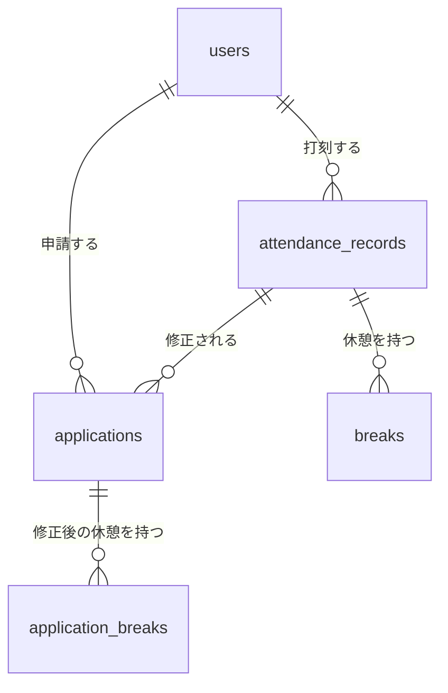

# 模擬案件\_勤怠管理アプリ\_要件定義\_詳細度100%

> **コーチ・採点者用の資料です。受講生には配布しません。**
> 受講生には「詳細度50%」版を配布します。50%版は本書から案件の内容の詳細を抜いて導出したものです。
>
> 対象は**新カリキュラム版**（提供Blade + Laravel Sail）です。旧カリキュラム版はこの資料の対象外です。

---

## この資料の読み方 ─ ヒアリングでどう答えるか

本書に載っているものは、**誰が決めたか**で3つに分かれます。ヒアリングでどう答えるかは、それで決まります。

| 区分 | 中身 | 本書での場所 | ヒアリングでの扱い |
|---|---|---|---|
| **案件の内容**<br>（クライアントが決めたこと） | クライアントが「こうなっていてほしい」と言えること | シート1・3〜7 | **答える。** 50%版に書いていない値も、聞かれたら事実として答える |
| **課題の条件**<br>（COACHTECH が決めたこと） | COACHTECH が課題として課している条件。実務の擬似ではない | シート2・8〜12 | **50%版にも100%と同じ内容が載っている。** 「シートに書いてあります」と案内する |
| **受講生が決める設計** | エンジニアが単独で決める領分 | 本書には**答えを置かない**（付録は模範解答の実装であって正解ではない） | **答えない。**「そこはお任せします」と返す |

**答えるものかどうかの判定は1問です。** アプリを触るだけで確かめられるか。**コードを読まないと分からないなら、答えるものではありません。**

| 答える（例） | 答えない（例） |
|---|---|
| どの操作をしたら、どの画面に行き、何と表示されるか | テーブル名・カラム名・型・制約 |
| 何を入力したら弾かれ、何と出るか | クラスをどう分けるか・どのメソッドに書くか |
| 誰が何をしてよいか | バリデーションの記法（`required` の書き方） |
| 労働時間や残業をどう数えるか | 労働時間をカラムに持つか、取り出すときに計算するか |
| APIが返す情報と、異常時に返すもの | テストケースの中身 |
| 動作確認用に何が入っていればよいか | ─ |

> ⚠️ **本書の「模範解答の実装（非開示）」と付録は、受講生が決める設計にあたります。** 模範解答がどう実装したかであって、正解ではありません。**ヒアリングでこの内容を答えないでください。**

---

## コーチ向けガイド: ヒアリング対応

受講生には「詳細度50%」の要件定義書と、提供Blade、提出物ガイドが配布されています。
受講生は曖昧な点を自分で洗い出し、`docs/questions.md`（確認事項リスト）に自分の想定を書いた上で、仮説提案型で確認してきます。

**答え方の規則は3行です。**

1. **案件の内容についての質問** → 本書の該当箇所を参照して、事実を答える
2. **課題の条件についての質問** → 「50%版の該当シートに書いてあります」と案内する（内容は同じ）
3. **設計についての質問** → 「そこはお任せします」と返す。**本書の付録や「模範解答の実装」を答えない**

| 受講生からの質問 | 答え方 | 参照先 |
|---|---|---|
| 出勤ボタンは1日に何回押せますか？ | 答える | シート3 機能要件 |
| 休憩を複数回取ったとき、詳細画面はどう見えますか？ | 答える | シート3 機能要件 |
| 修正申請を出したあと、勤怠情報はいつ書き換わりますか？ | 答える | シート3 機能要件 |
| 承認待ちの申請は編集できますか？ | 答える | シート3 機能要件 |
| 入力を間違えたときのメッセージの文言は？ | 答える | シート4 入力要件 |
| 労働時間・残業時間はどう数えますか？ | 答える | シート3 機能要件（マイ勤怠レポート） |
| 管理者は他人の勤怠を直接直せますか？ | 答える | シート3 機能要件 |
| 動作確認用のデータは何を入れておけばいいですか？ | 答える | シート7 初期データ |
| APIは何を返しますか／見つからないときは？ | 答える | シート6 API契約 |
| このページのURLは？ | シートに書いてあると案内 | シート8 URLとアクセス制御 |
| 認証は何を使いますか？ | シートに書いてあると案内 | シート10 制約条件 |
| 勤怠と休憩のテーブルはどう分けますか？ | **答えない** | ─ |
| 労働時間はカラムに持つべきですか？ | **答えない**（何時間になるかは答える。持ち方だけ答えない） | ─ |
| バリデーションは `date_format:H:i` でいいですか？ | **答えない**（何を弾くかは答える。書き方だけ答えない） | ─ |
| Policy クラスはどう分けますか？ | **答えない** | ─ |
| どんなテストケースを書けばいいですか？ | **答えない**（テストの対象カテゴリはシートにあると案内する） | ─ |

> ⚠️ **コーチの承認は採点に影響しません。** 合意した実装が要件とずれていた場合、経緯を採点時に正確に判断することが難しいため、公平性の観点から、評価基準に沿った実装が確認できなければ減点対象になります。この点は50%版にも明記してあります。

---

## シート1: 案件概要

本模擬案件の全体像です。**この内容はクライアントから受け取った案件の情報です。**

| 項目 | 内容 |
|---|---|
| タイトル | 実践学習ターム 模擬案件中級\_勤怠管理アプリ |
| 目的 | 模擬案件を通して、実務を想定したWebアプリケーション開発と、曖昧な要件から自ら仕様を設計しPMと詳細を詰めるプロセスを経験すること |
| 期間 | コーチと相談の上決めてください。 |
| 作成物 | coachtech 勤怠管理アプリ<br><br>【システム概要】<br>ある企業が自社の勤怠を管理するために使うアプリケーションです。<br>一般ユーザーは出勤・休憩・退勤を打刻し、自分の勤怠を月ごとに確認して、間違いがあれば修正を申請します。<br>管理者は全社員の勤怠を日ごと・人ごとに確認し、修正申請を承認したり、勤怠を直接修正したりします。<br><br>【応用機能で追加される要素】<br>・メールを用いた会員登録の認証<br>・月次勤怠一覧のCSV出力<br>・マイ勤怠レポート（労働時間・残業・遅刻や早退などの統計）<br>・外部アプリケーション向けの公開API（JSON）と Sanctum によるトークン認証 |
| 利用者 | 一般ユーザー（自分の勤怠を打刻・確認し、修正を申請する）／管理者（全ユーザーの勤怠を確認・修正し、修正申請を承認する）／外部アプリケーション（公開API経由で勤怠情報を扱う・応用） |
| 今回作らないもの | 退会機能・パスワード再設定画面・管理者の新規登録画面（管理者は初期データで用意する）・給与計算・シフト管理・打刻の位置情報 |
| 制作の背景と目的 | ユーザーの勤怠と管理を目的とする |
| 制作の目標 | 初年度でのユーザー数1000人達成 |
| 作業範囲 | 設計、コーディング、テスト |
| 納品方法 | GitHubでのリポジトリ共有 |
| 現行サービスの分析 | 新規サービスのため、考慮しない |
| 競合他社の調査・分析 | 機能や画面が複雑で使いづらい |
| ターゲットユーザー | 社会人全般 |
| ターゲットブラウザ・OS | PC：Chrome / Firefox / Safari 最新バージョン |
| 2フェーズ構成 | **フェーズ1（基本）**: 認証、打刻、勤怠一覧・詳細、修正申請、管理者の勤怠確認・修正・承認、スタッフ一覧<br>**フェーズ2（応用・★）**: メール認証、CSV出力、マイ勤怠レポート、公開API、Sanctum 認証 |
| 非機能要件 | 運用・保守はクライアントが行う／リリースは4ヶ月後を予定／セキュリティはアプリケーション内に限り考慮する／SEOは考慮しない |

> 💡 **`プロジェクト概要` タブの冒頭が「このプロジェクトはcoachtechフリマの開発計画です。」になっています。**
> 別課題の文面が混入したもので、本書では「ある企業が自社の勤怠を管理するために使うアプリケーションです」に直してあります。
> **現行のスプレッドシート側にも同じ修正が要ります**（→ Issue #6 に別件として記録）。

---

## シート2: 進め方とヒアリングの範囲

**このシートは、COACHTECH が定めた課題の条件です。**

### 教材の設定

あなたは開発会社のエンジニアです。クライアント企業のPM（プロジェクトマネージャー）から、勤怠管理アプリの開発を依頼されました。PMからは大まかな要件と画面（Bladeテンプレート）が提供されていますが、**詳細な仕様は固まっていません**。**コーチ = クライアントPM** として、あなたはPMにヒアリングを行い、詳細を詰めていきます。

### 進め方

| 手順 | やること |
|---|---|
| Step 1: 要件を読む | シート1・3〜7（案件の要件）と、シート2・8〜12（課題の条件）を読み、提供された Blade を開いて確認します。 |
| Step 2: 曖昧なところを洗い出す | 「この機能を実現するには何が必要か」「書かれていないことは何か」を洗い出し、**`docs/questions.md`（確認事項リスト）に自分の想定とともに書き出します**。 |
| Step 3: PMへのヒアリング | 面談内で、自分の想定を提示して確認します。答えが返らない領域（設計の領分）は、自分で決めて理由を残します。→「ヒアリングできること・できないこと」 |
| Step 4: 設計する | 確定した仕様をもとに設計し、`docs/` に設計書一式を書きます。書式は別紙「提出物ガイド\_設計書」を参照してください。 |
| Step 5: 実装する | 設計書をもとに実装します。実装中に決めが変わったら、**コードではなく設計書を先に直して**から実装に戻ります。 |

### ヒアリングできること・できないこと

ヒアリングできるのは**要件・仕様の確認**に限ります。判定はこの1問です。

> **アプリを触るだけで確かめられることか。コードを読まないと分からないなら、それはあなたが決める領分です。**

| 区分 | 例 | PMの答え |
|---|---|---|
| 答えます | 「勤怠一覧は、遷移した時点の月を表示する想定ですが、これで合っていますか？」<br>「打刻画面のステータスは `勤務外` から始まる想定ですが、合っていますか？」<br>「「休憩戻」を押したら `出勤中` に戻る想定ですが、問題ないですか？」<br>「管理者が修正した内容は、一般ユーザー側の勤怠にもそのまま反映される想定ですが、合っていますか？」<br>「残業は1日8時間を超えた分という想定ですが、合っていますか？」 | 事実を答えます |
| 案内します | 「勤怠詳細のURLは何ですか？」<br>「認証は何を使いますか？」 | 「シートに書いてあります」と案内します（課題の条件） |
| 答えません | 「休憩は勤怠と同じテーブルに持つべきですか？」<br>「労働時間はカラムに持つべきですか？」<br>「バリデーションは `date_format:H:i` の書き方でよいですか？」<br>「Policy クラスはどう分けるべきですか？」 | 「そこはお任せします」と返します |

> 💡 **聞き方**: 「〜はどうしますか？」と受け身で聞くのではなく、**「〜という想定にしましたが、問題ないですか？」と自分の仮説を提案する形**で聞いてください。PMも仮説ベースのほうが回答しやすく、やり取りの回数が減ります。

> 💡 **確認は任意です。** 回答を待たずに自分で決めて先へ進んで構いません。決めた内容と理由を `docs/questions.md` に残してください。

> ⚠️ **PMの承認は採点に影響しません。** コーチと合意した実装が要件とずれていた場合、経緯を採点時に正確に判断することが難しいため、公平性の観点から、評価基準に沿った実装が確認できなければ減点対象となります。

### 質問のルール

| 項目 | 内容 |
|---|---|
| チャットサポート | 原則利用は禁止です。教材やブラウザで検索した記事を参考にすることは可能です。GitHubでのエラーが解決できず提出が困難な場合はコーチに相談してください。質問の利用数は COACHTECH Pro の合格基準の対象です。 |
| **PMヒアリング** | **上記とは別枠です。合格基準の対象外なので、回数を気にせず行ってください。** |
| デザインについて | 画面（Blade・CSS）は完成品として提供されます。デザイン仕様についての質問は受け付けていません。 |
| 提出方法 | LMSのテスト一覧画面から提出してください。 |
| 注意点 | 教材学習に比べると急激に難易度が上がっています。焦らず、一歩ずつ開発を進めてください。基本機能の開発が終了次第、応用機能の開発に着手してください。 |

---

## シート3: 機能要件

ユーザーストーリーごとに「どの操作をしたらどうなるか」を整理したものです。**このシートは、クライアントから受け取った案件の内容です。**

> 💡 **★ は応用要件です。** 基本要件を実装してから着手してください。
> 💡 **「使用技術」は本シートから外し、シート10（制約条件）に集約しました。** どの機構を使うかは COACHTECH が課した条件で、案件の内容ではないためです。
> 💡 **入力チェックの中身とエラーメッセージの文言は、シート4（入力要件）にまとめました。**

### US001 新規一般ユーザーは、システムの一般機能に会員登録することができる

| 要件ID | 機能 | 完了条件 |
|---|---|---|
| FN001 | 登録認証機能（一般ユーザー） | 会員登録画面から、氏名・メールアドレス・パスワードを入力して一般ユーザーを登録できる |
| FN002 | バリデーション | 入力チェックが行われる（ルールはシート4） |
| FN003 | エラーメッセージ表示 | 入力チェックに違反したとき、シート4の文言がその項目の近くに表示される |
| FN004 | ユーザー認証動線 | 会員登録画面からログイン画面に遷移できる |
| FN005 | 初回ログイン時ユーザー設定 | 会員登録直後、打刻画面に遷移する（メール認証を実装しない場合） |

### US002 一般ユーザーは、システムの一般機能にログインすることができる

| 要件ID | 機能 | 完了条件 |
|---|---|---|
| FN006 | ログイン認証機能（一般ユーザー） | 登録済みの一般ユーザーがログインできる |
| FN007 | 入力フォーム | メールアドレスとパスワードを入力できる |
| FN008 | バリデーション | 入力チェックが行われる（ルールはシート4） |
| FN009 | エラーメッセージ表示 | 入力チェックに違反したとき、シート4の文言が表示される |
| FN010 | ユーザー認証動線 | ログイン画面から会員登録画面に遷移できる |
| ★ FN011 | ★ メールを用いた認証機能 | 1. 新規会員登録でメール認証を行う<br>2. 会員登録後にメール認証をしないでログインを試みた場合は、メール認証誘導画面へ遷移する<br>3. メール認証誘導画面内の「認証はこちらから」ボタンを押下するとメール認証画面へ遷移する<br>4. 画面遷移: 初回会員登録 → メール認証誘導画面 → メール認証画面 → 打刻画面<br>5. メール認証を行うのは会員登録時と初回ログイン時 |
| ★ FN012 | ★ 認証メール再送機能 | メール認証誘導画面で「認証メールを再送する」ボタンをクリックすると認証メールが再送信される |

### US003 一般ユーザーは、システムの一般機能からログアウトすることができる

| 要件ID | 機能 | 完了条件 |
|---|---|---|
| FN013 | ログアウト機能 | ヘッダーのボタンから正常にログアウトできる |

### US004 管理者ユーザーは、システムの管理機能にログインすることができる

| 要件ID | 機能 | 完了条件 |
|---|---|---|
| FN014 | ログイン認証機能（管理者） | 管理者ログイン画面から、登録済みの管理者がログインできる |
| FN015 | バリデーション機能 | 入力チェックが行われる（ルールはシート4） |
| FN016 | エラーメッセージ表示機能 | 入力チェックに違反したとき、シート4の文言が表示される |

### US005 管理者ユーザーは、管理機能からログアウトすることができる

| 要件ID | 機能 | 完了条件 |
|---|---|---|
| FN017 | ログアウト機能 | ヘッダーのボタンから正常にログアウトできる |

### US006 一般ユーザーは、勤怠の打刻をすることができる

| 要件ID | 機能 | 完了条件 |
|---|---|---|
| FN018 | 日時情報取得機能 | 打刻画面に現在の日時が、提供された画面と同じ形式で表示される |
| FN019 | ステータス確認機能 | 打刻画面に次の4つのいずれかのステータスが表示される<br>**`勤務外` / `出勤中` / `休憩中` / `退勤済`** |
| FN020 | 出勤機能 | 1. `勤務外` のときに「出勤」ボタンが表示される<br>2. 「出勤」は1日に1回だけ押せる<br>3. 「出勤」を押すと画面が `出勤中` のものに変わる<br>4. 出勤時刻が管理画面から正確に確認できる |
| FN021 | 休憩機能 | 1. `出勤中` のときに「休憩入」ボタンが表示される<br>2. 「休憩入」は1日に何回でも押せる<br>3. 「休憩入」を押すと画面が `休憩中` のものに変わる<br>4. `休憩中` のときに「休憩戻」ボタンが表示される<br>5. 「休憩戻」は1日に何回でも押せる<br>　a. 勤怠詳細画面に休憩回数分の行が表示される<br>6. 「休憩戻」を押すと画面が `出勤中` のものに変わる<br>7. 休憩に関する時刻が管理画面で正確に確認できる |
| FN022 | 退勤機能 | 1. `出勤中` のときに「退勤」ボタンが表示される<br>2. 「退勤」は1日に1回だけ押せる<br>3. 「退勤」を押すと「お疲れ様でした。」とメッセージが表示される<br>4. 「退勤」を押すとステータスが `退勤済` に変わる<br>5. 退勤時刻が管理画面から確認できる |

### US007 一般ユーザーは、勤怠一覧を確認することができる

| 要件ID | 機能 | 完了条件 |
|---|---|---|
| FN023 | 勤怠一覧情報取得機能 | 1. 自分が行った勤怠情報がすべて表示される<br>2. 列が提供された画面と同じ構成になっている（勤怠情報がない欄は空白） |
| FN024 | 月情報取得機能 | 1. 遷移した際に現在の月が表示される<br>2. 「前月」を押すと表示月の前月の情報が表示される<br>3. 「翌月」を押すと表示月の翌月の情報が表示される |
| FN025 | 詳細遷移機能 | 「詳細」を押すと、その日の勤怠詳細画面に遷移する |

### US008 一般ユーザーは、勤怠詳細を確認 / 修正申請することができる

| 要件ID | 機能 | 完了条件 |
|---|---|---|
| FN026 | 詳細情報取得機能 | 1. 「名前」が自分の氏名になっている<br>2. 「日付」が動線上で自分が選択した日付と一致している<br>3. 「出勤・退勤」「休憩」に記された時刻が自分の打刻と一致している<br>4. 「休憩」について、休憩回数分の行と、追加で1つ分の入力欄が表示される |
| FN027 | 項目編集機能 | 「出勤・退勤」「休憩」「備考」の3つを修正できる入力欄になっている<br>`承認待ち` の申請がある勤怠詳細は修正できず、「承認待ちのため修正できません」と表示される（提供 Blade が描画します） |
| FN028 | バリデーション機能 | 入力チェックが行われる（ルールはシート4） |
| FN029 | エラーメッセージ表示機能 | 入力チェックに違反したとき、シート4の文言が表示される |
| FN030 | 修正申請機能 | 「修正」を押すと修正申請が実行される。実行されると、その勤怠情報は<br>　1. 管理者の「申請一覧画面」に表示される<br>　2. 一般ユーザーの「申請一覧画面」の `承認待ち` 内に表示される |

### US009 一般ユーザーは、自分が行った申請を確認することができる

| 要件ID | 機能 | 完了条件 |
|---|---|---|
| FN031 | 承認待ち情報取得機能 | 1. `承認待ち` に、自分が行った申請のうち管理者が承認していないものがすべて表示される<br>2. 各項目に提供された画面と同一の項目が表示される<br>3. 管理者によって承認された場合は `承認済み` に移動する |
| FN032 | 承認済み情報取得機能 | 1. `承認済み` に、管理者が承認した修正申請がすべて表示される<br>2. 各項目に提供された画面と同一の項目が表示される |
| FN033 | 申請詳細表示機能 | 1. 各項目の「詳細」を押すと勤怠詳細画面に遷移する<br>2. `承認待ち` の申請詳細は修正できず、「承認待ちのため修正できません」と表示される（提供 Blade が描画します） |

> 🔒 **採点者向けの注意（非開示）**: 現行の要件シート・評価シートは「**承認待ちのため修正はできません。**」（「は」と句点あり）と書いていますが、
> 提供 Blade が実際に描画するのは `user/user-detail.blade.php` の「**承認待ちのため修正できません**」（「は」も句点も無し）です。
> 受講生は Blade を書かないので、この文言は受講生の実装で決まりません。**文言の差だけを理由に落とさないでください。**

### US010 管理者ユーザーは日次勤怠一覧を確認することができる

| 要件ID | 機能 | 完了条件 |
|---|---|---|
| FN034 | 勤怠情報取得機能 | 1. その日になされた全ユーザーの勤怠情報が確認できる<br>2. 勤怠情報が正確な値になっている<br>3. 列が提供された画面と一致している（まだ打刻されていない欄は空白） |
| FN035 | 日時変更機能 | 1. 遷移した際に現在の日付が表示される<br>2. 「前日」を押すと前の日の勤怠情報が表示される<br>3. 「翌日」を押すと次の日の勤怠情報が表示される |
| FN036 | 勤怠詳細表示機能 | 各勤怠の「詳細」を押すと勤怠詳細画面に遷移する |

### US011 管理者ユーザーは各勤怠の詳細を確認・修正することができる

| 要件ID | 機能 | 完了条件 |
|---|---|---|
| FN037 | 詳細情報取得機能 | 1. 詳細画面の内容が動線上で自分が選択した情報と一致している<br>2. 実際の勤怠内容が正しく反映されている |
| FN038 | 項目編集機能 | 「出勤・退勤」「休憩」「備考」を修正できる入力欄になっている |
| FN039 | バリデーション機能 | 入力チェックが行われる（ルールはシート4。一般ユーザーの修正申請と同じ） |
| FN040 | 修正機能 | 1. 「修正」を押すと、管理者として直接修正が実行される（申請を経由しない）<br>2. 修正された内容は一般ユーザーの勤怠情報としても反映されている |

### US012 管理者ユーザーはスタッフ一覧を確認することができる

| 要件ID | 機能 | 完了条件 |
|---|---|---|
| FN041 | ユーザー情報取得機能 | 全一般ユーザーの「氏名」「メールアドレス」が正しく表示される |
| FN042 | 月次勤怠遷移機能 | 「詳細」を押すと、そのユーザーの月次勤怠一覧に遷移する |

### US013 管理者ユーザーはスタッフ毎の月次勤怠一覧を確認することができる

| 要件ID | 機能 | 完了条件 |
|---|---|---|
| FN043 | 勤怠一覧情報取得機能 | 1. 動線上で選択したユーザーの勤怠情報がすべて表示される<br>2. 列が提供された画面と同じ構成になっている（勤怠情報がない欄は空白） |
| FN044 | 月表示変更機能 | 1. 遷移した際に現在の月が表示される<br>2. 「前月」を押すと表示月の前月の情報が表示される<br>3. 「翌月」を押すと表示月の翌月の情報が表示される |
| ★ FN045 | ★ CSV出力機能 | 「CSV出力」を押すと、そのユーザーが選択した月に行った勤怠一覧が、**文字化けせずに**CSVでダウンロードできる。ファイル名に当該ユーザーの名前が含まれる |
| FN046 | 詳細遷移機能 | 「詳細」を押すと、その日の勤怠詳細画面に遷移する |

### US014 管理者ユーザーは修正申請一覧を確認することができる

| 要件ID | 機能 | 完了条件 |
|---|---|---|
| FN047 | 承認待ち情報取得機能 | 1. `承認待ち` に、全一般ユーザーが行った未承認の修正申請がすべて表示される<br>2. データの項目が見出しと一致している |
| FN048 | 承認済み情報取得機能 | 1. `承認済み` に、全一般ユーザーが行ったこれまでの承認済み修正申請がすべて表示される<br>2. データの項目が見出しと一致している |
| FN049 | 申請詳細遷移機能 | 各項目の「詳細」を押すと申請詳細画面に遷移する |

### US015 管理者ユーザーは修正申請の詳細を確認 / 承認することができる

| 要件ID | 機能 | 完了条件 |
|---|---|---|
| FN050 | 申請詳細取得機能 | 1. 詳細画面の内容が動線上で自分が選択した情報と一致している<br>2. 実際の打刻内容が正しく反映されている |
| FN051 | 承認機能 | 「承認」を行うと次のようになる<br>1. 管理者の「申請一覧画面」で `承認待ち` から `承認済み` に変わる<br>2. 一般ユーザーの当該勤怠情報が更新され、修正申請の内容と一致する<br>3. 一般ユーザーの「申請一覧画面」で `承認待ち` から `承認済み` に変わる |

### ★ US016 一般ユーザーは、自分の勤怠統計レポートを確認することができる（応用）

| 要件ID | 機能 | 完了条件 |
|---|---|---|
| ★ FN052 | ★ マイ勤怠レポート画面表示機能 | `/attendance/report` にアクセスするとログインユーザーの勤怠統計が表示される。未認証時は `/login` にリダイレクトされる |
| ★ FN053 | ★ 基本サマリー表示機能 | 次の3項目が表示される<br>1. 総労働時間（過去6ヶ月の合計）<br>2. 総残業時間（**1日8時間を超えた分**の合計）<br>3. 平均労働時間（1日あたり） |
| ★ FN054 | ★ 月次推移表示機能 | 過去6ヶ月の労働時間と残業時間を月別に表示する。該当月にデータがない場合は 0 として表示する |
| ★ FN056 | ★ 異常検知表示機能 | 月内発生回数として次の3項目が表示される<br>1. 遅刻回数（出勤時刻が**始業時刻 9:00** を超えた回数）<br>2. 早退回数（退勤時刻が**終業時刻 18:00** より前の回数）<br>3. 長時間労働回数（労働時間が **10時間**を超えた日数） |

> ※ FN055 は欠番です（現行の要件シートも欠番）。

### ★ US017 外部アプリケーションは、勤怠データを公開APIで取得・操作することができる（応用）

エンドポイントの契約はシート6（API契約）にあります。ここには「何ができるか」だけを書きます。

| 要件ID | 機能 | 完了条件 |
|---|---|---|
| ★ FN057 | ★ 公開API ルート定義 | `routes/api.php` に API v1 のルートが定義され、`attendance-records` に対する5エンドポイント（一覧 / 詳細 / 登録 / 更新 / 削除）が実装されている。URL は kebab-case（`attendance-records`）、詳細取得・更新・削除のルートパラメータは `{attendanceRecord}` を用いる。読み取り系（GET）は認証不要、書き込み系（POST / PUT / PATCH / DELETE）は Sanctum 認証を適用する |
| ★ FN058 | ★ 公開API 勤怠一覧取得 (GET) | シート6 AP01 のとおり |
| ★ FN059 | ★ 公開API 勤怠詳細取得 (GET) | シート6 AP02 のとおり |
| ★ FN060 | ★ 公開API 勤怠登録 (POST) | シート6 AP03 のとおり |
| ★ FN061 | ★ 公開API 勤怠更新 (PUT) | シート6 AP04 のとおり |
| ★ FN062 | ★ 公開API 勤怠削除 (DELETE) | シート6 AP05 のとおり |
| ★ FN063 | ★ API 用コントローラーの分離 | Web 用コントローラー（`app/Http/Controllers/`）とは別に、**`App\Http\Controllers\Api\V1` 名前空間**の API 用コントローラーを作成する |
| ★ FN064 | ★ API Resource でのレスポンス整形 | **API Resource（`JsonResource` を継承したクラス）**でレスポンスを整形する。一覧と詳細で同じ Resource を共用し、`whenLoaded()` で関連の出し分けを行う。**クラス名は自分で決めてください** |
| ★ FN065 | ★ API 用 FormRequest | **`App\Http\Requests\Api\V1` 名前空間**に FormRequest を作成してバリデーションを実装する（`messages()` で日本語エラーメッセージ）。**クラス名は自分で決めてください** |
| ★ FN066 | ★ Sanctum 認証導入 | Laravel Sanctum を導入し、書き込み系 API（POST/PUT/DELETE）に `auth:sanctum` ミドルウェアを適用する。未認証時は 401 `{"message": "Unauthenticated."}` が返る |
| ★ FN067 | ★ Policy による認可 | **Policy** を作成し、書き込み系 API（PUT/DELETE）で**本人または管理者のみ**更新・削除可能とする。他ユーザーの操作時は 403 `{"error": "この操作を実行する権限がありません。"}` が返る。**クラス名は自分で決めてください** |
| ★ FN068 | ★ エラーJSON 統一 | `app/Exceptions/Handler.php` で、`api/*` パスの `ModelNotFoundException` を 404 JSON に、`AuthorizationException` を 403 JSON に変換する |

---

## シート4: 入力要件

入力チェックの内容と、違反したときに出す文言です。**このシートは、クライアントから受け取った案件の内容です。**

> ⚠️ **文言は一字一句そのままにしてください。評価項目になります。**
> ただし**バリデーションの書き方（`required` や `date_format` の記法、どのクラスに書くか）は指定しません。**
> 弾く条件と出す文言が合っていれば、書き方は自由です。

### 会員登録（FN002 / FN003）

| 項目 | 必須 | 制約 | 違反時のメッセージ |
|---|:-:|---|---|
| 氏名 | ○ | ─ | お名前を入力してください |
| メールアドレス | ○ | メール形式 | 未入力: メールアドレスを入力してください<br>形式違反: メールアドレスはメール形式で入力してください |
| パスワード | ○ | 8文字以上 | 未入力: パスワードを入力してください<br>8文字未満: パスワードは8文字以上で入力してください |
| 確認用パスワード | ○ | 8文字以上・パスワードと一致 | 不一致: パスワードと一致しません |

### ログイン（一般ユーザー・FN008 / FN009）

| 項目 | 必須 | 制約 | 違反時のメッセージ |
|---|:-:|---|---|
| メールアドレス | ○ | ─ | メールアドレスを入力してください |
| パスワード | ○ | ─ | パスワードを入力してください |
| （認証全体） | ─ | 登録済みの組み合わせであること | ログイン情報が登録されていません |

### ログイン（管理者・FN015 / FN016）

一般ユーザーのログインと同じです。

| 項目 | 必須 | 制約 | 違反時のメッセージ |
|---|:-:|---|---|
| メールアドレス | ○ | ─ | メールアドレスを入力してください |
| パスワード | ○ | ─ | パスワードを入力してください |
| （認証全体） | ─ | 登録済みの組み合わせであること | ログイン情報が登録されていません |

### 勤怠の修正（FN028 / FN029・一般ユーザーの修正申請と管理者の直接修正で共通）

| # | 弾く条件 | メッセージ |
|---|---|---|
| 1 | 出勤時間が退勤時間より後になっている／退勤時間が出勤時間より前になっている | 出勤時間もしくは退勤時間が不適切な値です |
| 2 | 休憩開始時間が出勤時間より前になっている／退勤時間より後になっている | 休憩時間が不適切な値です |
| 3 | 休憩終了時間が退勤時間より後になっている | 休憩時間もしくは退勤時間が不適切な値です |
| 4 | 備考欄が未入力 | 備考を記入してください |

> 💡 **休憩は複数行あります。** どの行が違反したのかが分かるように、エラーはその行の近くに出します（提供 Blade が行ごとの表示位置を用意しています）。

> 🔒 **模範解答の実装（非開示・ヒアリングで答えない）**: 模範解答は上記1・4のメッセージ末尾に句点「。」を付けています（`出勤時間もしくは退勤時間が不適切な値です。`）。要件・評価基準の正は**句点なし**です。採点で文言を突き合わせるときは、句点の有無だけを理由に落とさないでください。

### ★ 公開API 勤怠登録・更新（FN060 / FN061・応用）

| 項目 | 必須 | 制約 | 違反時のメッセージ |
|---|:-:|---|---|
| `date` | ○ | `YYYY-MM-DD` 形式／同じユーザーの同じ日付が既にないこと | 未入力: 勤怠日は必須です。<br>形式違反: 勤怠日は YYYY-MM-DD 形式で指定してください。<br>重複: この日付の勤怠は既に登録されています。 |
| `clock_in` | ○ | `HH:MM:SS` 形式 | 未入力: 出勤時刻は必須です。<br>形式違反: 出勤時刻は HH:MM:SS 形式で指定してください。 |
| `clock_out` | − | `HH:MM:SS` 形式／`clock_in` より後 | 形式違反: 退勤時刻は HH:MM:SS 形式で指定してください。<br>順序違反: 退勤時刻は出勤時刻より後の時刻を指定してください。 |
| `comment` | − | 255文字以内 | 備考は 255 文字以内で入力してください。 |

> ※ 更新（PUT）では、`date` の重複チェックから**自分自身を除外**します。
> ※ APIのメッセージは末尾に句点「。」が付きます（画面側の文言とは規則が違います）。

---

## シート5: データ要件

このアプリが管理する情報です。**このシートは、クライアントから受け取った案件の内容です。**

> ⚠️ **テーブル名・カラム名・型・制約は書いてありません。** 管理すべき情報の粒度までが要件で、**その先の設計はあなたが決める領分です。**
> ただし次の「提供 Blade が決めている名前」だけは例外で、配布物がすでに固定しています。

### 5-1. 提供 Blade が決めている名前（設計の自由度の外・課題の条件）

提供された Blade は、次の名前で値を読みます。**画面を動かすには、この名前で値が取れる必要があります。**
これはあなたの設計ではなく、配布物が持ち込んだ制約です。

| 種類 | 名前 |
|---|---|
| ユーザー | `name` ／ `email` ／ `admin_status`（管理者かどうか）／ `attendance_status`（打刻ステータス） |
| 勤怠 | `user_id`（所有者）／ `date` ／ `clock_in` ／ `clock_out` ／ `total_time` ／ `total_break_time` ／ `comment` |
| 休憩 | `break_in` ／ `break_out` |
| 修正申請 | `application_date` ／ `approval_status` ／ `new_date` ／ `new_clock_in` ／ `new_clock_out` ／ `comment` |
| リレーション | 修正申請 → 勤怠 は `AttendanceRecord`、修正申請 → 申請中の休憩 は `proposalBreaks`、修正申請 → ユーザー は `user`<br>（Blade の表記です。PHP のメソッド名は大文字小文字を区別しないので `attendanceRecord` と書いても動きます） |
| ビューに渡すキー | 勤怠詳細の画面には、休憩の配列を `breaks` というキーで渡す（勤怠詳細は整形済みの配列を受け取る作りです） |
| 打刻ステータスの値 | `勤務外` ／ `出勤中` ／ `休憩中` ／ `退勤済` |
| 承認状態の値 | `承認待ち` ／ `承認済み` |
| 打刻フォームの送信値 | `action` = `clock_in` ／ `clock_out` ／ `break_in` ／ `break_out` |
| 修正フォームの項目名 | `new_date` ／ `new_clock_in` ／ `new_clock_out` ／ `new_break_in[]` ／ `new_break_out[]` ／ `comment` |

> 💡 **`total_time` と `total_break_time` は「その名前で読める」ことだけが決まっています。**
> テーブルの列として持つのか、取り出すときに計算するのかは、あなたが決めて設計書に理由を残してください。

> 💡 **テーブル名は決まっていません。** 上の名前はすべて「値の名前」で、テーブルをどう分けてどう名づけるかは自由です。

### 5-2. 管理する情報

| まとまり | 管理する情報 |
|---|---|
| **ユーザー** | 氏名／メールアドレス（重複しない）／パスワード／管理者かどうか／打刻ステータス／メール認証を済ませた日時（★ 応用） |
| **勤怠** | どのユーザーの記録か／勤怠日／出勤時刻／退勤時刻（まだなら空）／備考／その日の労働時間／その日の休憩合計 |
| **休憩** | どの勤怠に属するか／休憩開始時刻／休憩終了時刻（まだなら空）。**1つの勤怠に何件でも付く** |
| **修正申請** | どのユーザーが出したか／どの勤怠に対するものか／申請日／承認状態／修正後の勤怠日・出勤時刻・退勤時刻・備考 |
| **修正申請の休憩** | どの修正申請に属するか／修正後の休憩開始時刻・終了時刻。**1つの申請に何件でも付く** |

### 5-3. 消したときの連鎖

| 消すもの | 一緒に消えるもの |
|---|---|
| ユーザー | そのユーザーの勤怠・修正申請 |
| 勤怠 | その勤怠の休憩・その勤怠に対する修正申請 |
| 修正申請 | その申請の修正後の休憩 |

> 💡 **連鎖はデータベースの外部キー制約で実現してください**（アプリ側で1件ずつ消す実装にしないこと）。

### 5-4. 数え方の決まり

| 何 | 決まり |
|---|---|
| 1日の労働時間 | 退勤時刻 − 出勤時刻 − 休憩合計 |
| 休憩合計 | その日の休憩の（終了 − 開始）の合計 |
| ★ 残業時間 | 1日の労働時間のうち **8時間を超えた分**（8時間以下の日は 0） |
| ★ 遅刻 | 出勤時刻が **9:00** より後 |
| ★ 早退 | 退勤時刻が **18:00** より前 |
| ★ 長時間労働 | 1日の労働時間が **10時間**を超えた日 |

---

## シート6: API契約（★ 応用）

**応用要件**で実装する公開API（JSON）の仕様です。**このシートは、クライアントから受け取った案件の内容です。**
外部アプリケーションから勤怠データを取得・操作できるエンドポイントを提供します。

読み取り系（GET）は認証不要、書き込み系（POST / PUT / DELETE）は **Sanctum 認証必須**で、PUT / DELETE は
**Policy による認可**（本人または管理者のみ操作可）が適用されます。

### エンドポイント一覧

| ID | メソッド | URI | 説明 | 認証・認可 |
|---|---|---|---|---|
| AP01 | GET | `/api/v1/attendance-records` | 勤怠一覧を取得する | 不要 |
| AP02 | GET | `/api/v1/attendance-records/{attendanceRecord}` | 勤怠詳細を取得する | 不要 |
| AP03 | POST | `/api/v1/attendance-records` | 勤怠を新規登録する | Sanctum 必須 |
| AP04 | PUT / PATCH | `/api/v1/attendance-records/{attendanceRecord}` | 勤怠を更新する | Sanctum ＋ 認可（本人または管理者のみ） |
| AP05 | DELETE | `/api/v1/attendance-records/{attendanceRecord}` | 勤怠を削除する | Sanctum ＋ 認可（本人または管理者のみ） |

### AP01: 勤怠一覧API

リクエストパラメータ

| パラメータ名 | 型 | 必須 | 説明 | 例 |
|---|---|:-:|---|---|
| `user_id` | integer | 任意 | ユーザーIDで絞り込み | 1 |
| `date` | date | 任意 | 日付で絞り込み（`YYYY-MM-DD`） | 2026-05-01 |
| `month` | string | 任意 | 年月で絞り込み（`YYYY-MM`） | 2026-05 |
| `page` | integer | 任意 | ページ番号（デフォルト 1） | 2 |
| `per_page` | integer | 任意 | 1ページあたりの件数（デフォルト 20、最大 100） | 20 |

レスポンス

| ステータス | 説明 | レスポンスボディ例 |
|---|---|---|
| 200 OK | 取得成功 | `{ "data": [{ "id": 1, "user_id": 1, "date": "2026-05-01", "clock_in": "09:00:00", "clock_out": "18:00:00", "total_time": "08:00", "total_break_time": "01:00", "comment": "..." }], "links": { ... }, "meta": { "current_page": 1, "from": 1, "last_page": 5, "per_page": 20, "to": 20, "total": 100 } }` |

> 🔒 **模範解答の実装（非開示・ヒアリングで答えない）**: 関連を eager load したうえで `when()` で絞り込み、`latest('date')->paginate($perPage)` でページ分割し、Resource のコレクションを返しています（`data` + `links` + `meta` は Laravel が自動で付けます）。

### AP02: 勤怠詳細API

| 項目 | 内容 |
|---|---|
| パスパラメータ | `{attendanceRecord}`（勤怠ID） |

レスポンス

| ステータス | 説明 | レスポンスボディ例 |
|---|---|---|
| 200 OK | 取得成功 | `{ "data": { "id": 1, "user": { "id": 1, "name": "山田太郎" }, "date": "2026-05-01", "clock_in": "09:00:00", "clock_out": "18:00:00", "breaks": [{ "id": 1, "break_in": "12:00:00", "break_out": "13:00:00" }], "applications": [], "comment": "..." } }` |
| 404 Not Found | IDが存在しない | `{ "error": "勤怠情報が見つかりませんでした。" }` |

### AP03: 勤怠登録API

リクエストボディ（JSON）: `date`（必須）／ `clock_in`（必須）／ `clock_out`（任意）／ `comment`（任意）
制約とメッセージはシート4「★ 公開API 勤怠登録・更新」を参照してください。

| ステータス | 説明 | レスポンスボディ例 |
|---|---|---|
| 201 Created | 登録成功 | `{ "data": { "id": 12, "date": "...", ... } }` |
| 422 Unprocessable Entity | バリデーションエラー | `{ "message": "The given data was invalid.", "errors": { "date": ["勤怠日は必須です。"], "clock_in": ["出勤時刻は必須です。"] } }` |
| 401 Unauthorized | 未認証 | `{ "message": "Unauthenticated." }` |

> 💡 **`user_id` はリクエストで受け取りません。** 認証したユーザーのものとして登録します。

### AP04: 勤怠更新API

リクエストボディは AP03 と同じです。

| ステータス | 説明 | レスポンスボディ例 |
|---|---|---|
| 200 OK | 更新成功 | `{ "data": { "id": 1, "date": "...", ... } }` |
| 404 Not Found | IDが存在しない | `{ "error": "勤怠情報が見つかりませんでした。" }` |
| 422 Unprocessable Entity | バリデーションエラー（`date` の重複チェックは自身を除外） | `{ "message": "The given data was invalid.", "errors": { "clock_in": ["出勤時刻は HH:MM:SS 形式で指定してください。"] } }` |
| 401 Unauthorized | 未認証 | `{ "message": "Unauthenticated." }` |
| 403 Forbidden | 他ユーザーの勤怠を更新しようとした | `{ "error": "この操作を実行する権限がありません。" }` |

### AP05: 勤怠削除API

| ステータス | 説明 | レスポンスボディ例 |
|---|---|---|
| 204 No Content | 削除成功 | （ボディなし） |
| 404 Not Found | IDが存在しない | `{ "error": "勤怠情報が見つかりませんでした。" }` |
| 401 Unauthorized | 未認証 | `{ "message": "Unauthenticated." }` |
| 403 Forbidden | 他ユーザーの勤怠を削除しようとした | `{ "error": "この操作を実行する権限がありません。" }` |

> 💡 削除すると、その勤怠に紐づく休憩と修正申請も一緒に消えます（シート5-3）。

### AP06: Sanctum APIトークン認証

| 項目 | 内容 |
|---|---|
| 認証方式 | Bearer トークン（`Authorization` ヘッダ） |
| 対象エンドポイント | AP03 / AP04 / AP05 |
| 認可 | 更新・削除は**本人または管理者のみ**。それ以外は 403 |

### レスポンスに含める情報

一覧（AP01）と詳細（AP02）で**同じ整形の仕組みを共用**し、関連（ユーザー・休憩・修正申請）は
**読み込んだときだけ**含めます（詳細では含まれ、一覧では省かれます）。

| フィールド | 内容 |
|---|---|
| `id` / `user_id` / `date` / `clock_in` / `clock_out` / `total_time` / `total_break_time` / `comment` | 勤怠そのもの |
| `user` | ユーザー（`id` / `name`）。読み込んだときのみ |
| `breaks` | 休憩の配列（`id` / `break_in` / `break_out`）。読み込んだときのみ |
| `applications` | 修正申請の配列。読み込んだときのみ |

### エラーレスポンスの統一

| 状況 | HTTPステータス | レスポンスボディ |
|---|---|---|
| 対象が見つからない（`api/*` パスのみ） | 404 | `{ "error": "勤怠情報が見つかりませんでした。" }` |
| バリデーションエラー | 422 | `{ "message": "...", "errors": { ... } }` |
| 未認証 | 401 | `{ "message": "Unauthenticated." }` |
| 権限がない | 403 | `{ "error": "この操作を実行する権限がありません。" }` |

---

## シート7: 初期データ

`php artisan migrate:fresh --seed` を実行したときに、**全機能の動作確認ができる状態**になっている必要があります。
**このシートは、クライアントから受け取った案件の内容です。**

> ⚠️ **どのシーダーをいくつ作るか、どのファイルに何を書くかは指定しません。** 満たすべき条件だけを書きます。

### 満たすべき条件（基本）

**ユーザー** — 管理者と一般ユーザーの両方を作ること

| # | メールアドレス | パスワード | 区分 | 備考 |
|---|---|---|---|---|
| 1 | `user1@example.com` | `password` | 一般 | メール認証済み |
| 2 | `user2@example.com` | `password` | 一般 | メール認証済み |
| 3 | `user3@example.com` | `password` | 管理者 | メール認証済み |

**勤怠記録** — 出勤・退勤・休憩時間のデータを作ること

- 全ユーザーに対して、勤怠と休憩のデータを作る
- **件数・日付分布は実運用に近い内容にすること**

### ★ 満たすべき条件（応用・マイ勤怠レポート採点用）

マイ勤怠レポートを実装する場合は、`user1` に次の**意図的なパターン**を含めてください。
採点者が `/attendance/report` の表示値と下の「予測値」を突き合わせて確認します。

- 過去5ヶ月: 各月平日15日 = **75日**の通常勤務（9:00-18:00）
- 当月 **17日**のパターン: 通常 10 ／ 残業（9:00-20:00）3 ／ 遅刻（9:30-18:00）2 ／ 早退（9:00-17:00）1 ／ 長時間労働（8:00-21:00）1
- `user1` の全レコードに**固定休憩 12:00-13:00（1時間）**を付与

**`user1` で `/attendance/report` を開いたときの予測値**

| 項目 | 値 |
|---|---|
| 過去6ヶ月 総労働時間 | **744 時間** |
| 過去6ヶ月 総残業時間 | **10 時間**（1日8時間の超過分） |
| 過去6ヶ月 平均労働時間 / 日 | **8 時間 5 分** |
| 当月 遅刻回数 | **2 回**（始業 9:00 超過） |
| 当月 早退回数 | **1 回**（終業 18:00 より前の退勤） |
| 当月 長時間労働回数 | **1 日**（1日10時間超） |

---

## シート8: URLとアクセス制御（課題条件）

**このシートは、COACHTECH が定めた課題の条件です。50%版にも同じ内容が載っています。**
提供された Blade がこのURLを直接書いているので、**変更できません。**

### 画面（GET）

| 画面 | パス | 認証 | 誰が見られるか | 対応する Blade |
|---|---|:-:|---|---|
| 会員登録 | `/register` | 不要 | 全員 | `user/register.blade.php` |
| ログイン（一般） | `/login` | 不要 | 全員 | `user/user-login.blade.php` |
| 打刻画面 | `/attendance` | 要 | 一般ユーザー | `user/attendance-register.blade.php` |
| 勤怠一覧（一般） | `/attendance/list` | 要 | 一般ユーザー（自分のぶんだけ） | `user/user-attendance-list.blade.php` |
| 勤怠詳細 | `/attendance/{id}` | 要 | 一般ユーザーは自分のぶんだけ／管理者は全員ぶん | 一般 `user/user-detail.blade.php`<br>管理者 `admin/admin-detail.blade.php` |
| 申請一覧 | `/stamp_correction_request/list` | 要 | 一般ユーザーは自分のぶんだけ／管理者は全員ぶん | 一般 `user/user-application-list.blade.php`<br>管理者 `admin/admin-application-list.blade.php` |
| 申請詳細（一般） | `/application/{id}` | 要 | 申請した本人 | `user/user-detail.blade.php` |
| ★ マイ勤怠レポート | `/attendance/report` | 要 | 一般ユーザー（自分のぶんだけ） | `reports/index.blade.php` |
| ★ メール認証誘導 | `/email/verify` | 要 | 未認証のユーザー | `auth/verify-email.blade.php` |
| ログイン（管理者） | `/admin/login` | 不要 | 全員 | `admin/admin-login.blade.php` |
| 勤怠一覧（管理者・日次） | `/admin/attendance/list` | 要 | 管理者 | `admin/admin-attendance-list.blade.php` |
| スタッフ一覧 | `/admin/staff/list` | 要 | 管理者 | `admin/staff-list.blade.php` |
| スタッフ別勤怠一覧（月次） | `/admin/attendance/staff/{id}` | 要 | 管理者 | `admin/staff-attendance-list.blade.php` |
| 修正申請承認 | `/stamp_correction_request/approve/{id}` | 要 | 管理者 | `admin/admin-application-detail.blade.php` |

> ⚠️ **勤怠詳細は一般ユーザーと管理者で同じURL（`/attendance/{id}`）です。** ログインしているユーザーが管理者かどうかで表示を切り替えます。
> 申請一覧（`/stamp_correction_request/list`）も同様です。

### 操作（GET 以外）

| 操作 | メソッド | パス | 送るもの |
|---|---|---|---|
| 会員登録 | POST | `/register` | `name` / `email` / `password` / `password_confirmation` |
| ログイン（一般） | POST | `/login` | `email` / `password` |
| ログアウト（一般） | POST | `/logout` | ─ |
| 打刻 | POST | `/attendance` | `action` = `clock_in` / `clock_out` / `break_in` / `break_out` |
| 勤怠の修正申請（一般）／直接修正（管理者） | POST | `/attendance/{id}` | `new_date` / `new_clock_in` / `new_clock_out` / `new_break_in[]` / `new_break_out[]` / `comment` |
| ログイン（管理者） | POST | `/admin/login` | `email` / `password` |
| ログアウト（管理者） | POST | `/admin/logout` | ─ |
| 修正申請の承認 | POST | `/stamp_correction_request/approve/{id}` | ─ |
| ★ CSV出力 | POST | `/export` | `user_id` / `year_month` |
| ★ 認証メールの再送 | POST | `/email/verification-notification` | ─ |
| ★ メール認証の実行 | GET | `/email/verify/{id}/{hash}` | （署名付きURL） |

### 月・日の切り替え

| 画面 | クエリパラメータ | 例 |
|---|---|---|
| 勤怠一覧（一般）・スタッフ別勤怠一覧 | `?date=YYYY-MM` | `/attendance/list?date=2026-04` |
| 勤怠一覧（管理者・日次） | `?date=YYYY-MM-DD` | `/admin/attendance/list?date=2026-04-15` |

### ★ 公開API（応用）

| メソッド | パス |
|---|---|
| GET | `/api/v1/attendance-records` |
| GET | `/api/v1/attendance-records/{attendanceRecord}` |
| POST | `/api/v1/attendance-records` |
| PUT / PATCH | `/api/v1/attendance-records/{attendanceRecord}` |
| DELETE | `/api/v1/attendance-records/{attendanceRecord}` |

---

## シート9: 提供物と環境構築（課題条件）

**このシートは、COACHTECH が定めた課題の条件です。50%版にも同じ内容が載っています。**

### 提供される Blade テンプレート

本課題では、**フロントエンド（Blade テンプレート・CSS・JS）は完成品として提供されます。**
受講生は提供された `resources/` を移入し、それが呼び出すルート／コントローラ／モデル／マイグレーション／
FormRequest／Policy／API／シーダ／テストを実装します（＝バックエンドの実装）。

- 提供リポジトリ: `https://github.com/coachtech-prepared-file/Preparedblade-mockcase-Attendance`
- ブランチ:
  - `basic` … 基本機能用（基本実装の開始時に移入）
  - `advanced` … 応用機能用（基本完了後、マイ勤怠レポート画面などの着手時に移入）
- 移入方法:
  1. 自分のプロジェクトとは別の場所で `git clone -b basic <上記URL>`
  2. クローン内の `resources/` を、自分のプロジェクトの `resources/` に上書きコピー
  3. クローンフォルダは削除
  （応用着手時は branch を `advanced` にして同じ手順で再移入）

### 環境構築手順（Laravel Sail）

> ⚠️ **本手順以外で構築した場合、採点できない場合があります。**

**1. Laravel 10 プロジェクトを新規作成**（最新版を避けるためバージョンを明示）

```bash
docker run --rm \
  -u "$(id -u):$(id -g)" \
  -v "$(pwd):/var/www/html" -w /var/www/html \
  -e COMPOSER_CACHE_DIR=/tmp/composer_cache \
  laravelsail/php82-composer:latest \
  composer create-project laravel/laravel:^10.0 attendance-app
cd attendance-app
```

**2. Laravel Sail を導入**（mysql, mailpit）

Laravel 10 の雛形には `laravel/sail` が dev 依存として既に含まれています。`compose.yaml` 生成前は
`./vendor/bin/sail` がまだ使えないため（`sail:install` が `compose.yaml` を生成するコマンドのため）、
`sail:install` は composer イメージ経由で実行します。

```bash
docker run --rm -u "$(id -u):$(id -g)" -v "$(pwd):/var/www/html" -w /var/www/html \
  laravelsail/php82-composer:latest php artisan sail:install --with=mysql,mailpit
```

> Apple Silicon（M1/M2/M3等）の場合は `compose.yaml` の mysql に `platform: 'linux/amd64'` を追記してください。

**3. phpMyAdmin を `compose.yaml` に追記**（mysql の下に追加）

```yaml
phpmyadmin:
    image: 'phpmyadmin:latest'
    ports:
        - '${FORWARD_PHPMYADMIN_PORT:-8080}:80'
    environment:
        PMA_HOST: mysql
        PMA_USER: '${DB_USERNAME}'
        PMA_PASSWORD: '${DB_PASSWORD}'
    networks:
        - sail
    depends_on:
        - mysql
```

**4. `.env` を編集（DB / メール）**

```
DB_CONNECTION=mysql
DB_HOST=mysql
DB_PORT=3306
DB_DATABASE=laravel
DB_USERNAME=sail
DB_PASSWORD=password
MAIL_MAILER=smtp
MAIL_HOST=mailpit
MAIL_PORT=1025
```

**5. 提供Blade の移入**（上記「提供される Blade テンプレート」を参照）

**6. フロントエンド（Vite）** — `vite.config.js` を次の内容に置き換える

```js
import { defineConfig } from 'vite';
import laravel from 'laravel-vite-plugin';

export default defineConfig({
    plugins: [
        laravel({
            input: [
                'resources/js/app.js',
                'resources/css/sanitize.css',
                'resources/css/common.css',
                'resources/css/auth/verify-email.css',
                'resources/css/user/register.css',
                'resources/css/user/user-login.css',
                'resources/css/user/attendance-register.css',
                'resources/css/user/user-attendance-list.css',
                'resources/css/user/user-detail.css',
                'resources/css/user/user-application-list.css',
                'resources/css/admin/admin-login.css',
                'resources/css/admin/admin-attendance-list.css',
                'resources/css/admin/admin-detail.css',
                'resources/css/admin/admin-application-list.css',
                'resources/css/admin/admin-application-detail.css',
                'resources/css/admin/staff-list.css',
                'resources/css/admin/staff-attendance-list.css',
                'resources/css/reports/index.css',
            ],
            refresh: true,
        }),
    ],
});
```

> `reports/index.css` は応用（マイ勤怠レポート）用です。基本のみの場合は最終行を除いて構いません。

**7. アプリ起動 & 初期化**

```bash
./vendor/bin/sail up -d
./vendor/bin/sail artisan key:generate
./vendor/bin/sail artisan migrate --seed
./vendor/bin/sail npm install
./vendor/bin/sail npm run dev
```

エイリアス推奨: `alias sail='[ -f sail ] && bash sail || bash vendor/bin/sail'`

**8. アクセス**

| 何 | URL |
|---|---|
| アプリ | `http://localhost` |
| phpMyAdmin | `http://localhost:8080` |
| Mailpit | `http://localhost:8025` |

---

## シート10: 制約条件（課題条件）

**このシートは、COACHTECH が定めた課題の条件です。50%版にも同じ内容が載っています。**

### 使用必須の技術

> ⚠️ **ここに挙げた機構は、使っていることが評価対象です。**
> 逆に、**ここに書いていない機構は評価しません。**好きなように設計して構いません。

| 対象 | 使用必須の技術 | 使う場所 |
|---|---|---|
| 認証（会員登録・ログイン・ログアウト） | **Laravel Fortify** | 一般ユーザー・管理者の両方 |
| 入力チェック | **FormRequest** | 認証を除くすべての入力（会員登録・ログイン・勤怠の修正・★ API） |
| DB操作 | **Eloquent ORM**（コントローラ内はこれで統一する） | 全体 |
| ★ メール認証 | **Mailpit または Mailtrap** | 会員登録時・初回ログイン時 |
| ★ API の名前空間 | **`App\Http\Controllers\Api\V1`**（Web 用と分ける）／ **`App\Http\Requests\Api\V1`** | 公開API |
| ★ API のレスポンス整形 | **API Resource**（`JsonResource` を継承したクラス） | 公開API |
| ★ API の認証 | **Laravel Sanctum**（`auth:sanctum` ミドルウェア） | 書き込み系（POST/PUT/DELETE） |
| ★ API の認可 | **Policy** | 更新・削除（本人または管理者のみ） |

> 💡 **クラス名は指定しません。** 「API Resource を使うこと」は条件ですが、そのクラスを何と名づけるかはあなたが決めます。

### 環境

| 項目 | 内容 |
|---|---|
| 開発言語 | PHP 8.2 |
| フレームワーク | Laravel 10.x |
| データベース | MySQL 8.4 |
| 開発環境 | **Laravel Sail**（Docker）。手順はシート9 |
| バージョン管理 | GitHub |
| 本番環境 | 用意しません（サーバー・ドメイン・SSL は考慮しない） |

> ⚠️ **指定技術スタック外のパッケージは追加しないでください**（`laravel-lang/*` 等）。
> 日本語化は `lang/` へメッセージファイルを手動配置して対応してください（サプライチェーン攻撃対策）。

### コード品質

| 対象 | 基準 |
|---|---|
| 命名 | 変数名に `a`・`x` のような意味のない名前を使わない／ローマ字など英単語でないもので命名しない |
| クラス名 | モデル・コントローラ・フォームリクエスト・シーディングは**アッパーキャメル** |
| ファイル名 | マイグレーションは**スネークケース** |
| テーブル名 | **スネークケース・複数形** |
| カラム名 | **スネークケース** |
| マイグレーション | **10個以内** |
| 整形 | 不要な改行や不適切なインデントを残さない／必要のないコメントアウトを残さない／使っていないクラスを `use` で読み込まない |
| ★ 型宣言 | 全メソッドに引数と戻り値の型宣言をする（コントローラ・モデル・FormRequest・Policy）。モデルのリレーションメソッドには `HasMany` / `BelongsTo` / `BelongsToMany` などの具体的な戻り値型を書く |
| ★ PHPDoc | 主要なメソッドに、処理内容・引数・戻り値を説明する PHPDoc を書く |
| ★ Collection | `foreach` などのループを避け、`map` / `filter` / `groupBy` / `flatMap` などを活用する（特にマイ勤怠レポート） |
| ★ N+1 | 勤怠一覧の取得などで Eager Loading（`with` 等）を使い、N+1 問題を防ぐ |

---

## シート11: 提出要件（課題条件）

**このシートは、COACHTECH が定めた課題の条件です。50%版にも同じ内容が載っています。**

### 提出物

| 何 | 中身 |
|---|---|
| ソースコード | GitHub のリポジトリ |
| `README.md` | アプリの概要・環境構築手順（**この手順どおりでマイグレーションまで通ること**）・使用技術・ER図 |
| **`docs/` の設計書一式（7ファイル）** | `features.md` / `questions.md` / `screens.md` / `data.md` / `permissions-api.md` / `behavior.md` / `acceptance.md`<br>**書式は別紙「提出物ガイド\_設計書」を参照してください。** |

> ⚠️ **設計の巧拙は評価に含みません。** 確認するのは、設計書が提出され、指定の書式で書かれ、確認事項リストが埋まっていることだけです。
> 設計の内容は、実装が要件どおり動くかという形で評価されます。

### テスト要件

**PHPUnit** で、次のカテゴリのテストを書いてください。

> ⚠️ **テストケースの中身（何をどう検証するか）は指定しません。** 対象カテゴリだけが要件です。

| # | 対象 |
|---|---|
| 1 | 認証機能（一般ユーザー） |
| 2 | ログイン認証機能（一般ユーザー） |
| 3 | ログイン認証機能（管理者） |
| 4 | 日時取得機能 |
| 5 | ステータス確認機能 |
| 6 | 出勤機能 |
| 7 | 休憩機能 |
| 8 | 退勤機能 |
| 9 | 勤怠一覧取得機能（一般ユーザー） |
| 10 | 勤怠詳細情報取得機能（一般ユーザー） |
| 11 | 勤怠詳細情報修正機能（一般ユーザー） |
| 12 | 勤怠一覧情報取得機能（管理者） |
| 13 | 勤怠詳細情報取得・修正機能（管理者） |
| 14 | ユーザー情報取得機能（管理者） |
| 15 | 勤怠情報修正機能（管理者） |
| ★ 16 | ★ 公開API 読み取り系 |
| ★ 17 | ★ 公開API 書き込み系 |
| ★ 18 | ★ Sanctum 認証 |
| ★ 19 | ★ マイ勤怠レポート機能 |

### 提出方法

LMSのテスト一覧画面から提出してください。

---

## シート12: デザインUI（課題条件）

**このシートは、COACHTECH が定めた課題の条件です。50%版にも同じ内容が載っています。**

> ⚠️ **画面（Blade・CSS）は完成品として提供されます。受講生の実装対象外です。**
> デザインの再現度・レスポンシブ対応は評価しません。デザイン仕様についての質問も受け付けていません。

| 項目 | 内容 |
|---|---|
| 対象ブラウザ | Chrome / Firefox / Safari の最新バージョン |
| 対象幅 | PC（1400〜1540px）。提供 Blade で実現済み |
| 画面の一覧 | シート8「URLとアクセス制御」の対応 Blade を参照 |

あなたがすることは、**提供された Blade が必要とする値を、正しい名前で渡すこと**です（シート5-1）。

---

## 付録: 模範解答のテーブル構造（非開示・正解ではない）

> 🔒 **この付録は受講生に配布しません。ヒアリングでも答えないでください。**
> **模範解答がどう実装したかであって、正解ではありません。** テーブル名・カラム名・型・制約は
> 受講生が決める領分で、要件を満たしていれば別の設計でも減点しません。
> 採点時に「模範解答と違うから」を理由にしないための、**参照専用の資料**です。

### テーブル仕様

**`users`**（Laravel 標準に2列追加）

| カラム | 型 | 制約 | 補足 |
|---|---|---|---|
| `id` | bigint unsigned | PK | |
| `name` | string | NOT NULL | 氏名 |
| `email` | string | NOT NULL・UNIQUE | |
| `email_verified_at` | timestamp | NULL可 | ★ メール認証 |
| `password` | string | NOT NULL | |
| `remember_token` | string | NULL可 | |
| `admin_status` | boolean | NOT NULL・default `false` | 管理者かどうか |
| `attendance_status` | string | NOT NULL・default `勤務外` | `勤務外` / `出勤中` / `休憩中` / `退勤済` |
| `created_at` / `updated_at` | timestamp | | |

**`attendance_records`**

| カラム | 型 | 制約 | 補足 |
|---|---|---|---|
| `id` | bigint unsigned | PK | |
| `user_id` | bigint unsigned | FK → `users.id`・ON DELETE CASCADE | |
| `date` | date | NOT NULL | 勤怠日 |
| `clock_in` | time | NOT NULL | 出勤時刻 |
| `clock_out` | time | NULL可 | 退勤時刻 |
| `total_time` | string | NULL可 | その日の労働時間（**列として保持している**） |
| `total_break_time` | string | NULL可 | その日の休憩合計（**列として保持している**） |
| `comment` | string | NULL可 | 備考 |
| `created_at` / `updated_at` | timestamp | | |

**`breaks`**

| カラム | 型 | 制約 | 補足 |
|---|---|---|---|
| `id` | bigint unsigned | PK | |
| `attendance_record_id` | bigint unsigned | FK → `attendance_records.id`・ON DELETE CASCADE | |
| `break_in` | time | NOT NULL | 休憩開始 |
| `break_out` | time | NULL可 | 休憩終了 |
| `created_at` / `updated_at` | timestamp | | |

**`applications`**（修正申請）

| カラム | 型 | 制約 | 補足 |
|---|---|---|---|
| `id` | bigint unsigned | PK | |
| `user_id` | bigint unsigned | FK → `users.id`・ON DELETE CASCADE | 申請者 |
| `attendance_record_id` | bigint unsigned | FK → `attendance_records.id`・ON DELETE CASCADE | 対象の勤怠 |
| `approval_status` | string | NOT NULL | `承認待ち` / `承認済み` |
| `application_date` | date | NOT NULL | 申請日 |
| `new_date` | date | NOT NULL | 修正後の勤怠日 |
| `new_clock_in` | time | NOT NULL | 修正後の出勤時刻 |
| `new_clock_out` | time | NOT NULL | 修正後の退勤時刻 |
| `comment` | string | NOT NULL | 備考 |
| `created_at` / `updated_at` | timestamp | | |

**`application_breaks`**（修正申請の休憩）

| カラム | 型 | 制約 | 補足 |
|---|---|---|---|
| `id` | bigint unsigned | PK | |
| `application_id` | bigint unsigned | FK → `applications.id`・ON DELETE CASCADE | |
| `break_in` | time | NOT NULL | |
| `break_out` | time | NULL可 | |
| `created_at` / `updated_at` | timestamp | | |

このほか Laravel / Fortify / Sanctum の標準テーブル（`password_resets` / `failed_jobs` / `personal_access_tokens`）を使っています。
マイグレーションファイルは**10個**です（制約の「10個以内」ちょうど）。

### ER図



### 模範解答が採った設計判断（参考）

| 論点 | 模範解答の選択 | 備考 |
|---|---|---|
| 労働時間・休憩合計 | **列として保持**（`total_time` / `total_break_time`） | 取り出すときに計算する設計でも要件は満たします |
| 勤怠詳細のURL | 一般・管理者で**共有**（`/attendance/{id}`）し、ログインユーザーの `admin_status` で分岐 | 提供 Blade がこのURLを書いているため |
| 修正申請中の休憩 | **別テーブル**（`application_breaks`）に持つ | 承認前の値を確定値と混ぜないため |
| 打刻ステータス | `users` の**文字列カラム**に日本語で保持 | 提供 Blade が日本語リテラルで比較しているため |

> ⚠️ **上の4つはいずれも「模範解答がそうした」というだけです。** 別の選択をした提出を、この表を理由に減点しないでください。
